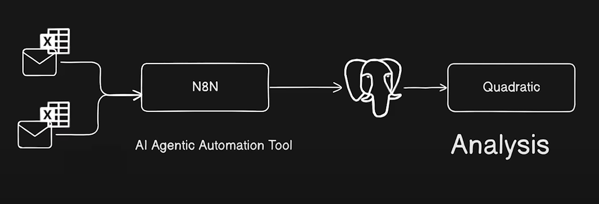
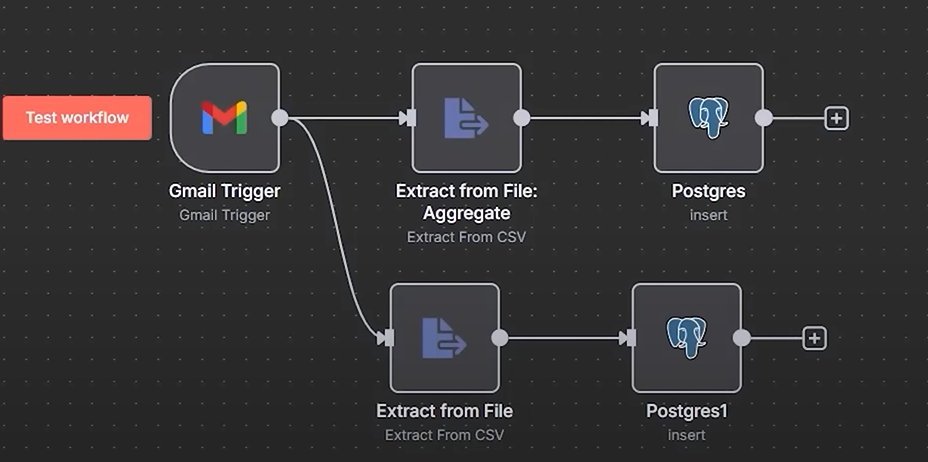

# AI-Enabled Supply Chain Analytics Pipeline

## Project Overview

This project demonstrates the development of an end-to-end supply chain analytics solution using AI tools. The primary objective is to automate the ingestion of daily sales data from emails, store it in a PostgreSQL database, and perform advanced analytics using Quadratic, an AI-powered spreadsheet tool. The project aims to address supply chain inefficiencies by providing real-time insights and key performance indicators (KPIs).

## Technical Architecture

### Data Ingestion

1. **Email Monitoring**:
   - **Tool**: N8N
   - **Function**: Monitors specific email inboxes for incoming CSV files.
   - **Filters**: Configured to identify emails with specific subjects (e.g., "daily sales").

2. **CSV File Processing**:
   - **Tool**: N8N
   - **Function**: Extracts data from CSV files and converts it into JSON format.
   - **Steps**:
     - Extract attachments from emails.
     - Convert CSV data to JSON for ingestion.

3. **Database Ingestion**:
   - **Database**: PostgreSQL
   - **Hosting**: Superbase
   - **Function**: Ingests JSON data into PostgreSQL tables.
   - **Tables**: Fact orders, order lines, customers, products, and target orders.

### Data Analysis

1. **AI-Powered Analysis**:
   - **Tool**: Quadratic
   - **Function**: Pulls data from PostgreSQL and performs AI-powered analysis.
   - **KPIs Calculated**:
     - Line Fill Rate: 85%
     - Volume Fill Rate: 90%
     - On-Time Delivery Rate: 95%
     - On-Time in Full (OTIF) Percentage: 80%

### Prerequisites

- **N8N**: Workflow automation tool.
- **PostgreSQL**: Relational database.
- **Superbase**: Cloud-based platform for hosting PostgreSQL databases.
- **Quadratic**: AI-powered spreadsheet tool.

## Usage Examples

### Example 1: Monthly On-Time Performance

1. **Prompt**: "Show me monthly on-time performance by cities."
2. **Result**: Quadratic generates a chart showing the trend of on-time performance across different cities.

### Example 2: Top Customers by Order Value

1. **Prompt**: "Show me the top five customers based on their order value and on-time in full (OTIF) percentage."
2. **Result**: Quadratic generates a table with customer ID, customer name, city, total order value, OTIF percentage, and on-time percentage.
